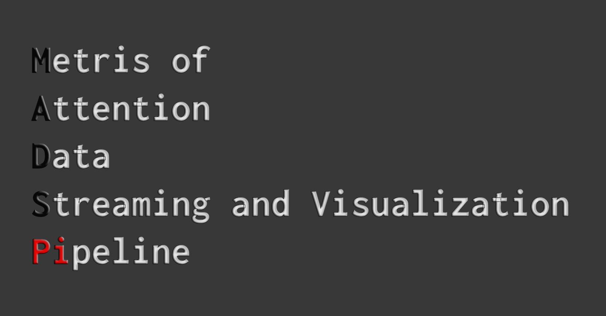

# Project in Informatics: Metrics of Attention Data Streaming and Visualization Pipeline



## Project Goals

Open-source pipeline for collecting data on eyetracking, heart rate, and electrodermal activity when a reader is viewing or interacting with a visual data story. Should support both EmotiBit and Tobii Pro Spark through Lab Streaming Layer (LSL)

End result should be a graphical tool that combines and captures the data from supported devices during an experimental session. Ideally for Linux or Mac OS,

Some design requirements:

- Allow the user to select, order, and arrange visual stimuli of interest, with adjustable onscreen time lengths for each stimulus. Visual stimuli for testing will be provided to you and your team
- Launch a eyetracking calibration session that the user may accept the results for, or redo (via a button click)
- Enable the user to start and end the experiment using only the mouse
- Both the calibration and the experimental modes of the application should toggle automatically to fullscreen mode
- Place event markers in the data stream for the beginning of the experiment (i.e., the display of the first of the visual stimuli), each change of stimulus, and the end of the experiment
- Provide a visualization view after an experiment has been run that shows a summary heatmap overlay of eye movements over each stimulus image. Additional visuals include a time overlay of eye movements over each stimulus, with line charts showing the heart rate and electrodermal activity values that correspond with the eye movements. Event markers from the experiment should be visually indicated on the line charts
- The dataset from the experiment should be exportable as a JSON or CSV file

Optionally instead of a sequence of images it would be better for it to work with videos or webpages as well, although screen recording may present a problem across platforms

## Development

### Get running quick

#### Windows

```powershell
git clone https://github.com/NickMarcha/MadsPi.git
cd madspipeline
scripts\setup_windows.ps1
.\.venv\Scripts\activate
python src/madspipeline/main.py
```

#### Linux

```bash
git clone https://github.com/NickMarcha/MadsPi.git
cd madspipeline
bash scripts/setup_linux.sh
source .venv/bin/activate
python src/madspipeline/main.py
```

#### macOS

```bash
git clone https://github.com/NickMarcha/MadsPi.git
cd madspipeline
bash scripts/setup_macos.sh
source .venv/bin/activate
python src/madspipeline/main.py
```

### Hardware Notes

Install USB/serial drivers for your device.

On Linux: set udev rules for device access.

On macOS: ensure necessary permissions in System Settings.

On Windows: check Device Manager and install OEM drivers.
