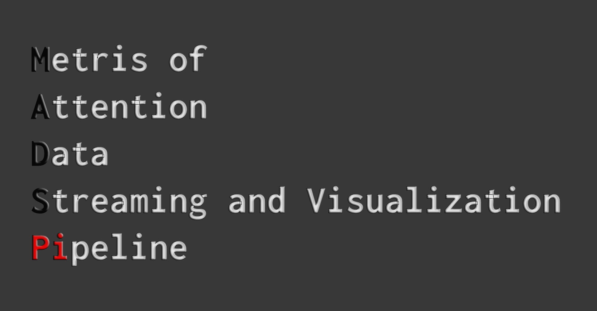

# MadsPipeline: Metrics of Attention Data Streaming and Visualization Pipeline



## Project Overview

Open-source pipeline for collecting physiological data on eyetracking, heart rate, and electrodermal activity when a reader is viewing or interacting with a visual data story. Supports both **EmotiBit** and **Tobii Pro Spark** through **Lab Streaming Layer (LSL)**.

End result: a graphical tool that combines and captures data from supported devices during experimental sessions with synchronized video recording and event marking.

---

## Design Requirements

- Allow selection, ordering, and arrangement of visual stimuli with adjustable display times
- Launch eyetracking calibration sessions (accept/redo via button click)
- Start and end experiments using only the mouse
- Automatic fullscreen toggle for calibration and experimental modes
- Event markers in data stream for experiment start, stimulus changes, and experiment end
- Post-experiment visualization with heatmap overlays, time-aligned eye movements, and heart rate/EDA charts
- Exportable datasets (JSON/CSV format)
- Support for image sequences, videos, and webpages (with screen recording)

---

## Quick Start

### Windows

```powershell
git clone https://github.com/NickMarcha/MadsPi.git
cd MadsPi
Set-ExecutionPolicy -ExecutionPolicy RemoteSigned -Scope CurrentUser  # If needed
scripts\setup_windows.ps1
.\.venv\Scripts\activate
python src/madspipeline/main.py
```

### Linux

```bash
git clone https://github.com/NickMarcha/MadsPi.git
cd MadsPi
bash scripts/setup_linux.sh
source .venv/bin/activate
python src/madspipeline/main.py
```

### macOS

```bash
git clone https://github.com/NickMarcha/MadsPi.git
cd MadsPi
bash scripts/setup_macos.sh
source .venv/bin/activate
python src/madspipeline/main.py
```

### Hardware Setup
- **Windows**: Check Device Manager; install OEM USB/serial drivers
- **Linux**: Set udev rules for device access
- **macOS**: Ensure necessary permissions in System Settings

---

## Project Structure

```
MadsPipeline/
├── src/madspipeline/              # Main source code
│   ├── main.py                    # Entry point
│   ├── main_window.py             # Qt6 GUI (3700+ lines)
│   ├── models.py                  # Data models & enums
│   ├── project_manager.py         # Project persistence
│   ├── lsl_integration.py         # LSL streaming & recording
│   ├── screen_recorder.py         # Video capture with sync
│   ├── madsBridge.py              # HTML ↔ Python bridge
│   └── lsl_manager.py             # LSL stream management UI
├── tests/                         # Test suite
│   ├── unit/                      # Unit tests (models, data)
│   └── integration/               # Integration tests (GUI, LSL, bridge)
├── .github/
│   └── copilot-instructions.md    # AI agent coding guidelines
├── scripts/                       # Setup scripts (Windows/Linux/macOS)
├── .vscode/                       # Debug & task configs
├── pyproject.toml                 # Project configuration
├── pytest.ini                     # Test configuration
└── requirements-dev.txt           # Development dependencies
```

---

## Architecture

### Three-Layer Design

**GUI Layer** (`main_window.py`)
- Qt6 desktop application
- Project/session management dialogs
- Session windows for each project type
- Screen recording integration

**Integration Layer**
- `lsl_integration.py`: LSL event streaming & multi-stream recording
- `screen_recorder.py`: Video capture with sync event markers
- `madsBridge.py`: HTML ↔ Python event communication
- `lsl_manager.py`: Stream detection & configuration UI

**Data Layer**
- `models.py`: Dataclasses for projects, sessions, configurations
- `project_manager.py`: JSON persistence to `tracking_data/{project_id}/sessions/{session_id}/`
- Output: MP4 video + LSL JSON + metadata

### Project Types

| Type | Config | Features |
|------|--------|----------|
| **Picture Slideshow** | `PictureSlideshowConfig` | Auto-advance, slide duration, fade/slide transitions |
| **Video** | `VideoConfig` | Auto-play, seek to start/end times, looping |
| **Embedded Webpage** | `EmbeddedWebpageConfig` | HTML bridge, LSL events, screen recording, fullscreen |
| **Screen Recording** | `ScreenRecordingConfig` | Window/fullscreen capture, FPS, resolution, codecs |

---

## Development

### Running Tests
```bash
# All tests
python -m pytest tests -v

# Unit tests only
python -m pytest tests/unit -v

# Integration tests only
python -m pytest tests/integration -v

# Specific test
python -m pytest tests/integration/test_embedded_webpage_session.py::test_page_load -v

# With coverage
python -m pytest tests --cov=src/madspipeline --cov-report=html
```

### Code Quality
```bash
# Format with Black (88 char lines)
black --line-length=88 src/

# Lint with Flake8
flake8 src/

# Sort imports
isort src/

# Type check (strict)
mypy src/madspipeline/
```

All configured in `pyproject.toml`; VS Code auto-formats on save.

### Debug Configurations (VS Code / Cursor)
- **Launch Main Application**: Run app directly
- **Launch with run.py**: Use launcher script
- **Debug Current Test File**: Debug open test file
- **Run All Tests**: Execute full test suite
- **Run Unit Tests**: Unit tests only
- **Run Integration Tests**: Integration tests only

---

## LSL Time Synchronization (Phase 1 ✅)

### Problem Solved
Previously, timestamps from different LSL devices were in **different clock domains**:
- Each device had its own clock (EmotiBit, Bridge Events, Mouse Tracking, etc.) ❌
- Timestamps could not be directly compared across devices ❌
- Manual clock offset correction required for analysis ❌

### Solution Implemented
1. **Online Clock Synchronization**: LSL `proc_clocksync` postprocessing flag enabled
   - All device timestamps automatically corrected to local time domain
   - Real-time synchronization during recording
   - Accuracy: < 1 ms on local networks

2. **Bridge events use `local_clock()`** for LSL time domain alignment
   - Ensures bridge events are in the same synchronized time domain

3. **Dual Timestamp Storage**: Both synchronized and original timestamps preserved
   - `timestamp`: Synchronized to local time domain (for direct comparison)
   - `original_timestamp`: Original device clock time (for reference)

4. **Clock offset measurements** recorded for post-hoc analysis and validation

### Code Changes
**File: `src/madspipeline/madsBridge.py`**
```python
# Bridge events timestamped with LSL clock
if LSL_AVAILABLE and local_clock:
    event_data['timestamp'] = local_clock()  # LSL time domain
    event_data['wall_clock'] = datetime.now().isoformat()  # Reference
else:
    event_data['timestamp'] = datetime.now().isoformat()  # Fallback
```

**File: `src/madspipeline/lsl_integration.py`**
```python
# Create inlet (pyLSL Python bindings don't support postproc_flags)
inlet = StreamInlet(stream)

# Apply clock synchronization manually by adding clock_offset to timestamps
# This achieves the same result as LSL's automatic postprocessing
clock_offset = inlet.time_correction()  # Clock offset measurement
original_timestamp = timestamp  # Original device timestamp
synchronized_timestamp = timestamp + clock_offset  # Synchronized to local time domain
```

### Result
✅ **All device timestamps are automatically synchronized** to local time domain  
✅ **Direct timestamp comparison** across devices (EmotiBit, Bridge Events, Mouse Tracking)  
✅ **Original timestamps preserved** for reference and validation  
✅ **Clock offset measurements** recorded for post-hoc analysis  
✅ **Real-time synchronization** during recording (no post-processing required)  
✅ **Backward compatible** - existing analysis tools can use `timestamp` field directly  

---

## Video & Event Timestamp Synchronization (Phase 2 ✅)

### Problem
- LSL event recording starts immediately when session begins
- Screen video recording starts slightly after (after page load)
- Early events have no corresponding video frames
- Timestamps don't align for playback

### Solution
Screen recorder sends a **`video_recording_started` sync event** containing:
- `type`: `'video_recording_started'`
- `timestamp`: LSL clock time when video recording began (in event data)
- `session_id`, `wall_clock`: Additional metadata

### Using the Sync Event

**Find sync marker:**
```python
def find_sync_event(events):
    for event in events:
        if event.get('type') == 'video_recording_started':
            return event

sync_event = find_sync_event(recorded_events)
# Get timestamp from event data (bridge events store timestamp in data.timestamp)
video_offset = sync_event.get('data', {}).get('timestamp') or sync_event.get('timestamp')  # e.g., 9.8 seconds
```

**Align events to video:**
```python
# Convert LSL timestamp to video playback time
# Use relative_time from the sync event sample, or calculate from timestamp
video_offset = sync_event_sample.get('relative_time')  # Time when video started (relative to session)
video_time = event_sample.get('relative_time') - video_offset

if video_time < 0:
    print(f"Event occurred {abs(video_time):.2f}s BEFORE video started")
else:
    print(f"Seek video to {video_time:.2f}s to see this event")
```

### Benefits
- Negative `video_time` → event before video recording (not on screen)
- Positive `video_time` → event at this position in video
- No complex offset calculations needed in review tools
- All data preserved; transparent about timing

---

## Data Output Format

### Session Directory Structure
```
tracking_data/{project_id}/sessions/{session_id}/
├── screen_recording_{session_id}.mp4       # Video capture
├── screen_recording_info_{session_id}.json # Video metadata (FPS, resolution)
├── lsl_recording_{session_id}.json         # All LSL streams + events
└── tracking_data.json                       # Legacy format
```

### LSL Recording JSON Sample
```json
{
  "session_id": "session_20251118_143022",
  "session_start_time": 671.234,
  "synchronization_info": {
    "sync_method": "LSL_online_clocksync",
    "sync_enabled": true,
    "description": "Timestamps are automatically synchronized to local time domain using LSL proc_clocksync postprocessing",
    "timestamp_field": "timestamp (synchronized to local time domain)",
    "original_timestamp_field": "original_timestamp (device clock domain, for reference)"
  },
  "lsl_samples": [
    {
      "timestamp": 671.345,
      "original_timestamp": 671.3462,
      "relative_time": 0.111,
      "stream_name": "MadsPipeline_BridgeEvents",
      "stream_type": "Markers",
      "data": ["page_load"],
      "clock_offset": 0.0012,
      "synchronization_applied": true
    },
    {
      "timestamp": 680.8,
      "original_timestamp": 680.8015,
      "relative_time": 9.566,
      "stream_name": "EmotiBit_BrainFlow",
      "stream_type": "EmotiBit",
      "data": [6546.0, -0.188, 0.397, 0.275],
      "clock_offset": 0.0015,
      "synchronization_applied": true
    }
  ]
}
```

**Note**: The `timestamp` field contains **synchronized timestamps** that can be directly compared across all devices. The `original_timestamp` field preserves the device's native clock time for reference.

---

## Common Development Tasks

| Task | File | Pattern |
|------|------|---------|
| Add LSL stream type | `lsl_integration.py` | Create StreamInlet, append to recorded_data in `record_sample()` |
| Change video codec | `screen_recorder.py` | Modify `codecs_to_try` list; H264 > XVID > mp4v |
| Add bridge event | `madsBridge.py` | Already handles JSON; send via `sendEvent()` from HTML |
| New project type | `models.py` + `main_window.py` | Add enum, config class, UI dialogs |
| Change save location | `project_manager.py` | Modify base path; sessions → `project_path/tracking_data/` |

---

## Known Limitations & Workarounds

1. **Screen recording latency** → Use sync marker event to align timestamps during playback
2. **LSL device clock drift** → Automatically handled via `proc_clocksync`; timestamps synchronized in real-time. Clock offsets still recorded for validation and post-hoc analysis.
3. **HTML iframe isolation** → Use QWebChannel bridge only; external scripts unavailable
4. **Cross-platform video codecs** → Fallback chain: H264 → XVID → mp4v; auto-tested
5. **Qt6 DPI scaling (Windows)** → Handled via Windows API or DPR multiplier in ScreenRecorder

---

## Testing Strategy

**Unit Tests** (`tests/unit/`)
- Model enums and conversions
- Config dataclass serialization
- Project/session loading

**Integration Tests** (`tests/integration/`)
- HTML bridge event flow
- LSL stream recording with sync events
- Screen recording with video sync markers
- Session lifecycle

**Critical Path:** `pytest tests/integration/test_embedded_webpage_session.py`

---

## Troubleshooting

| Issue | Solution |
|-------|----------|
| **Timestamp misalignment** | Check sync event in LSL JSON; verify `video_recording_started` sent; see "Video & Event Timestamp Synchronization" section |
| **LSL streams not appearing** | Run LSL Manager dialog ("Refresh Streams"); verify device connected/powered |
| **Video doesn't align with events** | Verify sync marker in JSON; calculate offset: `video_time = event_relative_time - sync_event_relative_time` |
| **HTML bridge not firing** | Confirm `madsBridge.js` loaded; check browser console for errors |
| **Project won't load** | Verify JSON structure; check `Project.from_dict()` in project_manager.py |

---

## Development Roadmap

### Completed (✅ Phase 1-2)

**Project Structure & Data Management**
- ✅ Project folder structure system
- ✅ Project metadata storage and configuration
- ✅ Project type system (Picture Slideshow, Video, Screen Recording, Embedded Webpage)
- ✅ Sessions folder organization
- ✅ Session management and metadata

**Main Application GUI**
- ✅ Main application window with PySide6
- ✅ Project selection startup screen
- ✅ Dashboard with session/project management
- ✅ Project editing dialog
- ✅ Debug session window with live tracking

**Mouse Tracking System**
- ✅ Real-time mouse coordinate capture
- ✅ Mouse click events (left, right, middle)
- ✅ Mouse scroll events
- ✅ Extensible tracking data format (JSON)
- ✅ Debug visualization with movement trails

**LSL Integration (Phase 1-2 ✅)**
- ✅ HTML-to-Python bridge via QWebChannel
- ✅ LSL stream outlet for bridge events
- ✅ Bridge event streaming to LSL in real-time
- ✅ LSL stream recording during sessions
- ✅ Clock synchronization (local_clock vs wall_clock)
- ✅ Clock offset measurement per sample
- ✅ Video recording with sync marker events

**Technical Infrastructure**
- ✅ Data models (Project, Session, Config dataclasses)
- ✅ Data persistence layer (JSON file storage)
- ✅ Configuration management system
- ✅ Project/session loading and saving

---

### Phase 3: Critical Data Management & Testing (Target: Nov 25, 2025)

**Data Export System** ⏳ Priority: HIGH
- [ ] Fix export to include actual tracking data (currently only exports project info)
- [ ] Implement CSV export format with configurable columns
- [ ] Implement JSON export format maintaining full structure
- [ ] Add session-level export (single session data)
- [ ] Add project-level export (all sessions in project)
- [ ] Add data sanitization/filtering options

**LSL Stream Synchronization Testing** ⏳ Priority: HIGH
- [ ] Test LSL clock sync for mouse tracking stream
- [ ] Test LSL clock sync for hardware device streams (EmotiBit, Tobii)
- [ ] Verify clock offset calculations per stream
- [ ] Document sync validation procedures
- [ ] Create sync test fixtures for CI/CD

**LSL Stream Management Overhaul** ⏳ Priority: HIGH
- [ ] Redesign LSL Manager UI for channel/type selection
- [ ] Add per-device stream filtering (select which channels to record)
- [ ] Implement device-specific configuration profiles
- [ ] Add stream preview/validation before recording
- [ ] Store device preferences in project config

**Video Playback Validation** ⏳ Priority: HIGH
- [ ] Verify video resolution accuracy in recordings
- [ ] Test event overlay alignment with video playback
- [ ] Validate sync marker offsets with actual recordings
- [ ] Create test cases for different video codecs

**UI/UX Improvements** ⏳ Priority: MEDIUM
- [ ] Disable "Debug Session" button (future enhancement)
- [ ] Add "Open in Explorer" button to project overview
- [ ] Add folder navigation for session data
- [ ] Improve project overview card layout

**Logging (New)**
- Application output (both logging and redirected stdout/stderr) is written to a `logs/` folder at the repository root.
- Each run creates a timestamped log file named `madspipeline_YYYYMMDD_HHMMSS.log` which contains console messages and any `print()` output.
- The `logs/` folder is included in `.gitignore` to prevent runtime logs from being committed.

**LSL Manager Overhaul (Updates)**
- The LSL Stream Manager UI now includes a per-stream "Record" checkbox so you can explicitly select which available LSL streams should be recorded.
- Selected streams are stored in the project `embedded_webpage` LSL configuration under `additional_stream_filters` so the recorder can respect user choices during sessions.

**Project File Structure Review** ⏳ Priority: MEDIUM
- [ ] Audit current tracking_data directory layout for redundancy
- [ ] Identify and consolidate duplicate data files
- [ ] Optimize session metadata organization
- [ ] Document final structure schema
- [ ] Create migration utility if needed

---

### In Progress / Planned (Phase 4+)

**Screen Recording System**
- [ ] Cross-platform screen recording (Windows/Linux/macOS) - Partially done (Windows working, needs testing on other platforms)
- [ ] Recording quality settings (resolution, FPS, codec) - Basic settings implemented
- [ ] Recording preview window - Not started
- [ ] Fullscreen application recording optimization

**Session Review & Analysis**
- [ ] Session review window with video playback
- [ ] Video playback controls (play, pause, seek, speed)
- [ ] Frame-by-frame navigation
- [ ] Tracking data overlay on playback
- [ ] Event marker system for review
- [ ] Marker categorization and export

**Data Visualization & Overlays**
- [ ] Advanced overlay rendering system
- [ ] Mouse cursor and click indicators
- [ ] Movement trails and heatmaps
- [ ] Time-series charts for tracking data
- [ ] Heart rate/EDA overlays (hardware integration)

**Export & Data Management**
- [ ] Video export with overlays
- [ ] Project dataset export (multi-session) - See Phase 3
- [ ] Batch export functionality

**Future Hardware Integration**
- [ ] EmotiBit device detection and streaming
- [ ] Tobii Pro Spark eyetracker integration
- [ ] Plugin system for new devices
- [ ] Advanced synchronization with multiple LSL devices
- [ ] Post-hoc device clock synchronization

**Testing & Quality Assurance**
- [ ] Unit tests for core functionality
- [ ] Integration tests for recording pipeline
- [ ] GUI testing framework
- [ ] Performance testing for real-time operations
- [ ] Cross-platform compatibility testing

**Documentation**
- [ ] User manual and tutorials
- [ ] In-app help system
- [ ] Keyboard shortcuts guide
- [ ] Progress indicators and status messages

---

## Implementation Priorities

| Phase | Focus | Target | Status |
|-------|-------|--------|--------|
| **1** | GUI structure, project management | ✅ Complete | ✅ Complete |
| **2** | Screen recording, mouse tracking, LSL sync | ✅ Complete | ✅ Complete |
| **3** | Data export, LSL testing & management, playback validation | Nov 25, 2025 | 🚧 In Progress |
| **4** | Session review, video playback overlays | Dec 2025 | ⏳ Planned |
| **5** | Hardware integration (EmotiBit, Tobii) | Jan 2026 | ⏳ Planned |

**Phase 3 Breakdown (Critical Path - Nov 25 Deadline):**
- Data export system (CSV/JSON, session/project level)
- LSL stream sync validation for all device types
- LSL Manager UI overhaul (channel/type selection per device)
- Video resolution & playback alignment testing
- Minor UI improvements (disable debug button, add explorer navigation)
- Project file structure audit & optimization

---

## License

MIT License - See LICENCE file for details

---

## Contributing

This project is part of an academic research initiative. For contributions, feature requests, or bug reports, please contact the MadsPipeline team.
